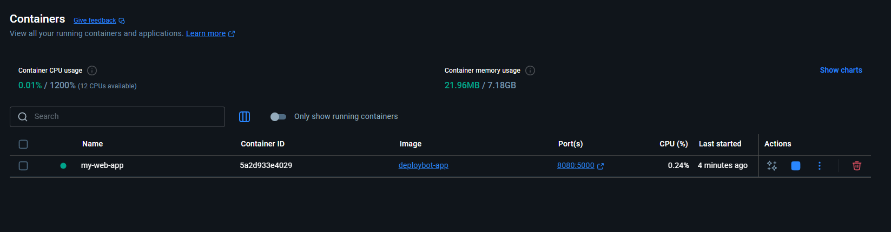

# DeployBot: AI-Powered CI/CD Pipeline

> An intelligent, event-driven CI/CD pipeline that uses AI to optimize deployment strategies and provide real-time feedback for microservice-based applications.

This repository documents the step-by-step creation of the DeployBot project, intended to showcase modern DevOps and MLOps practices.

---

## 🚀 Current Status - Milestone 1: Application Containerization

The project has successfully completed its first milestone. The primary goal was to take a simple web application and package it into a standardized, portable unit using Docker.

**Key Achievements in this Milestone:**

*   Developed a basic web application using Python and the Flask framework.
*   Authored a `Dockerfile` that defines the steps to build a runnable image of the application.
*   Successfully troubleshot dependency and networking issues within the Docker build process.
*   The application is now fully containerized, ensuring it can run consistently on any machine with Docker.
*   The initial code, including the application source and `Dockerfile`, has been pushed to this GitHub repository.
---



---

### Technologies Used in this Milestone

*   **Python (Flask)**
*   **Docker**
*   **Git / GitHub**
*   **Bash (for command-line operations)**

---

## 🏃 How to Run the Demo (Milestone 1)

You can run the current version of this project on any machine with Docker installed.

**1. Clone the Repository**
```bash
git clone git@github.com:Devsathome/ai-powered-cicd-pipeline.git
cd ai-powered-cicd-pipeline